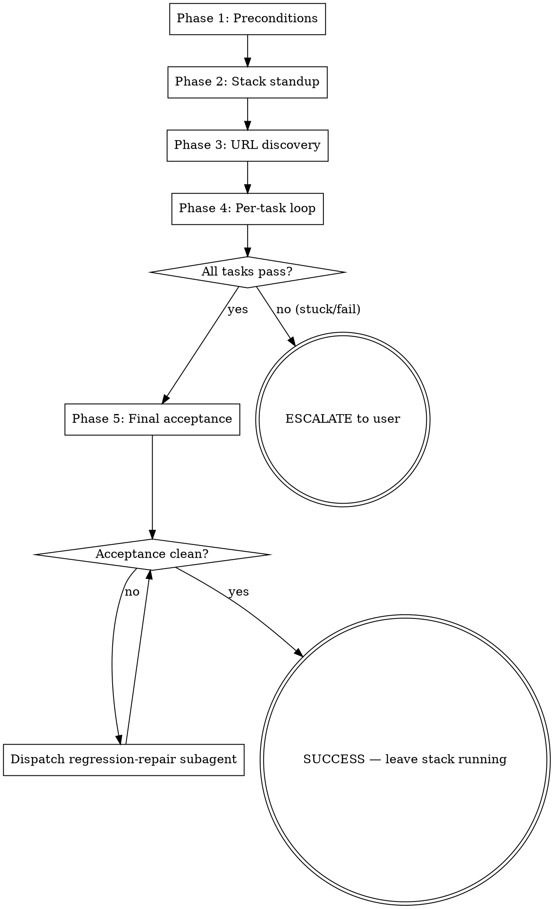

# Devloop — Build with Eyes On

Execute an existing design spec + implementation plan with live verification. Per-task toolkit selection:

- **playwright** — web UI observation via browser (DOM, console, network)
- **xcodebuildmcp** — iOS/macOS simulator observation (screenshots, tap/swipe)
- **api** — HTTP endpoint verification (integration tests + live curl)
- **cli** — command-line tool verification (integration tests + live run + proof snapshot)

Auto-detects project structure from cwd:
- **docker** (mx/compose) → brings up stack, APIs via Traefik URL
- **xcode** (.xcodeproj/.xcworkspace) → builds for simulator
- **standalone** (Cargo.toml, go.mod, package.json, etc.) → builds locally

**Announce at start:** "I'm using the devloop skill to execute the plan with live verification."

## Architecture in one paragraph

The orchestrator (this file) runs in the main session and owns lifecycle: precondition gate, environment standup, target discovery, dispatching one subagent per plan task, and the final acceptance pass. Each subagent runs in isolated context using the prompt in `subagent-prompt.md` — it does the code work, then verifies via the task's assigned toolkit (playwright, xcodebuildmcp, api, or cli), iterates until acceptance criteria pass, and returns structured JSON. The verification toolkit is classified per-task (not per-project) based on keywords in the task title/criteria or an explicit `**Verify via:**` tag.

## Read these references on demand

**Per-toolkit (subagent reads the one matching its task):**
- `references/observe-modes.md` — Playwright (web UI)
- `references/xcode-observe-modes.md` — XcodeBuildMCP (iOS simulator)
- `references/api-observe-modes.md` — API endpoint verification
- `references/cli-observe-modes.md` — CLI tool verification

**Per-project-structure (orchestrator reads during standup):**
- `references/url-discovery.md` — Traefik label parsing (docker projects)
- `references/mx-cli-reference.md` — mx commands (docker projects)
- `references/xcodebuildmcp-reference.md` — XcodeBuildMCP tool mapping (xcode projects)

**Shared:**
- `subagent-prompt.md` — the per-task subagent template (handles all toolkits)
- `examples/sample-task-result.json` — the JSON shape returned by subagents

## Flow

## Phase 1 — Preconditions & project structure detection

- [ ] **1.1 Detect project structure.** Check cwd in this order:
  - Glob `*.xcodeproj` or `*.xcworkspace` in cwd or one level deep → **`project_structure = xcode`**
  - Look for `mx.toml` or compose marker per `references/mx-cli-reference.md` → **`project_structure = docker`**
  - Look for `Cargo.toml`, `go.mod`, `package.json`, or `pyproject.toml` → **`project_structure = standalone`**
  - None found → abort: "No recognized project structure. cd into a project directory."
  - Record `project_structure` — it gates Phase 2 and 3.
- [ ] **1.2 Verify observation toolkits are available.** Scan the plan's task titles and acceptance criteria to determine which toolkits will be needed. For each:
  - `playwright` needed: check that `mcp__plugin_playwright_playwright__browser_navigate` is callable. If not, abort with install hint.
  - `xcodebuildmcp` needed: run ToolSearch for "XcodeBuildMCP". If zero results, abort with install hint.
  - `api` needed: no MCP required — uses curl/bash. Pass.
  - `cli` needed: no MCP required — uses bash. Pass.
  - If no toolkit is determinable from the plan (no keywords, no tags), default based on project_structure and pass.
- [ ] **1.3 Verify environment tooling.**
  - If `project_structure = docker`: run `which mx`. If empty, abort: "mx CLI not found."
  - If `project_structure = xcode`: run `which xcodebuild`. If empty, abort: "Xcode command-line tools not found."
  - If `project_structure = standalone`: detect build tool. Check (priority order): Makefile with `build` target → `make`; `Cargo.toml` → `cargo`; `go.mod` → `go`; `package.json` with build script → `npm`; `pyproject.toml` → `python`. Record as `build_command`. If none found, warn but continue (might be interpreted language).
- [ ] **1.4 Verify spec exists.** Glob `docs/superpowers/specs/*-design.md`. Zero matches → abort: "No design spec found. Run brainstorming skill first." Multiple matches → use the most recent by filename date prefix.
- [ ] **1.5 Verify plan exists.** Glob `docs/superpowers/plans/*.md`. Same handling as 1.4. The most recent plan is the active one. If the plan file contains `**Compatible with:** devloop skill` in its header, acceptance criteria are expected inline per task. Otherwise, subagent derives at runtime.
- [ ] **1.6 If user passed `--from-scratch`:** Abort with: "--from-scratch is a v0.2 feature. Run brainstorming + writing-plans first."

## Phase 2 — Environment standup

### If `project_structure = docker`:

- [ ] **2.1d Check router.** `mx router status`. If `stopped` or `not installed`, run `mx router up`.
- [ ] **2.2d Check services.** `mx ps`. If target services already running, skip 2.3d.
- [ ] **2.3d Start services.** Prefer `mx dev` (hot-reload). Poll `mx ps` every 2s for up to 60s waiting for all services to show `Up`/`running`.
- [ ] **2.4d Detect restart loops.** If any service transitions through `Restarting` ≥3 times, abort with `mx logs <service> 2>&1 | tail -n 50`.
- [ ] **2.5d Brief log sanity.** `mx logs 2>&1 | tail -n 20`. If fatal errors, abort with excerpt.

### If `project_structure = xcode`:

- [ ] **2.1x Discover Xcode project.** Glob `*.xcworkspace` (preferred) or `*.xcodeproj`. Record as `xcode_project_path`.
- [ ] **2.2x Verify scheme.** Check `.xcodebuildmcp/config.yaml` for scheme, else auto-detect.
- [ ] **2.3x Test build.** XcodeBuildMCP `simulator/build`. If fails, abort with compiler errors.
- [ ] **2.4x Verify simulator.** Confirm simulator booted from build output.

### If `project_structure = standalone`:

- [ ] **2.1s Detect build tool.** Per Phase 1.3 detection. Record `build_command`.
- [ ] **2.2s Run initial build.** Execute `build_command` (e.g., `cargo build`, `go build`, `make build`). If build fails, abort with compiler errors.
- [ ] **2.3s Start server (if plan has API tasks).** Detect server start command from: Makefile `dev`/`serve` target, package.json `start`/`dev` script, or plan instructions. Start in background. Record `target_url = http://localhost:<port>`. Wait up to 15s for the port to respond.
- [ ] **2.4s Record binary path (if plan has CLI tasks).** After build, locate the binary (e.g., `./target/debug/<name>`, `./bin/<name>`). Record as `binary_path`.

## Phase 3 — Target discovery

### If `project_structure = docker`:

- [ ] **3.1d Read** `references/url-discovery.md` and follow the algorithm.
- [ ] **3.2d Single URL discovered:** capture as `target_url`, continue.
- [ ] **3.3d Multiple URLs:** abort with candidate list (v0.1 behavior).
- [ ] **3.4d Zero URLs:** abort with `mx router inspect` + `mx ps`, ask user.
- [ ] **3.5d Reachability check.** `curl -k -I -m 5 <target_url>` retried every 5s for 30s. Accept 2xx/3xx/401/403.

### If `project_structure = xcode`:

- [ ] **3.1x Build and run.** XcodeBuildMCP `simulator/build-and-run`.
- [ ] **3.2x Verify launch.** Confirm no crash. Take initial screenshot.
- [ ] **3.3x Record target.** Set `target_url = "simulator"`. Record `xcode_project_path`.

### If `project_structure = standalone`:

- [ ] **3.1s Target already set.** `target_url` (if API) or `binary_path` (if CLI) was recorded in Phase 2. Nothing additional to discover.
- [ ] **3.2s Reachability check (API only).** If `target_url` was set, `curl -s -o /dev/null -w "%{http_code}" <target_url>` — any response means server is up.

## Phase 4 — Per-task loop

- [ ] **4.1 Create scratch dir.** `mkdir -p /tmp/devloop-run-$(date -u +%Y-%m-%dT%H-%M-%S)/`. Capture path as `scratch_dir`.
- [ ] **4.2 Parse the plan.** Read the plan file. Identify task blocks (each `### Task N:` heading with its body). For each task, note whether ALL its `- [ ]` step checkboxes are unchecked (task is unstarted) or partially/fully checked (task is in-progress or done).
- [ ] **4.3 Iterate unchecked tasks in plan order.** For each task with at least one unchecked step:
  - [ ] **4.3.1 Classify verify toolkit.** Check (in priority order):
    1. If task block contains `**Verify via:** <toolkit>`, use that value.
    2. Otherwise, lowercase task title + acceptance criteria text. Match against keyword lists in `references/api-observe-modes.md`, `references/cli-observe-modes.md`, `references/observe-modes.md`, `references/xcode-observe-modes.md`. Most keyword hits wins.
    3. If no match: default by project_structure (`docker` → `api`, `xcode` → `xcodebuildmcp`, `standalone` → `cli`).
    Set `verify_toolkit` to one of: `playwright`, `xcodebuildmcp`, `api`, `cli`.
  - [ ] **4.3.1b Classify observe mode (playwright/xcodebuildmcp only).** If `verify_toolkit` is `playwright` or `xcodebuildmcp`, check keyword list in the corresponding observe-modes reference. Set `observe_mode` to `static` or `interactive`. For `api`/`cli`, set `observe_mode = "n/a"`.
  - [ ] **4.3.2 Build the subagent prompt.** Substitute into the template from `subagent-prompt.md`:
    - `{{spec_excerpt}}` — full spec content
    - `{{plan_task_block}}` — verbatim task block
    - `{{project_root}}` — absolute path
    - `{{project_structure}}` — `docker`, `xcode`, or `standalone`
    - `{{verify_toolkit}}` — `playwright`, `xcodebuildmcp`, `api`, or `cli`
    - `{{target_url}}` — URL for docker/standalone-api, `"simulator"` for xcode, `"n/a"` for standalone-cli
    - `{{binary_path}}` — path to built binary (cli tasks only, empty otherwise)
    - `{{observe_mode}}` — `static`, `interactive`, or `n/a`
    - `{{scratch_dir}}` — scratch directory path
  - [ ] **4.3.3 Dispatch subagent** using the Agent tool with the substituted prompt. Wait for return.
  - [ ] **4.3.4 Parse the JSON return.** The subagent's last message must parse as JSON. If parse fails, treat as `{status: "fail", summary: "subagent did not return valid JSON", evidence: {...raw...}}`.
  - [ ] **4.3.5 On `status: "pass"`:** mark all unchecked steps in this task block as `[x]` in the plan file. Continue to next task.
  - [ ] **4.3.6 On `status: "stuck"` or `status: "fail"`:** stop the loop. Surface the subagent's `summary`, `evidence`, `files_changed`, and `next_step_hint` to the user. Ask: "skip this task / retry this task / abort all". Act on response. If "abort all", proceed to no further tasks.

## Phase 5 — Final acceptance

- [ ] **5.1 Compose per-task verification prompts.** For each completed task, build a verification-only subagent prompt using that task's `verify_toolkit` and acceptance criteria. The subagent's job is RE-VERIFY only (no code changes).
- [ ] **5.2 Dispatch acceptance subagent.** Send a single subagent that re-runs the verification pass for EACH completed task using the appropriate toolkit (playwright tasks get browser checks, api tasks get live curl, cli tasks get live run). Return JSON with `status: "pass"` only if ALL tasks re-verify clean.
- [ ] **5.3 If acceptance returns `pass`:** report success summary to user. Note target URL (if applicable) and that the environment is left running. STOP.
- [ ] **5.4 If acceptance returns non-pass:** dispatch ONE "regression repair" subagent with the failing task's details and `next_step_hint`. If repair returns `pass`, re-run 5.2 once. If still non-pass, escalate to user with full evidence.

## Error handling — quick reference

| Failure | Response |
|---|---|
| mx not installed (web) / xcodebuild not found (iOS) | Abort with install hint |
| Playwright MCP unavailable (web) / XcodeBuildMCP unavailable (iOS) | Abort with `claude mcp add` hint |
| Xcode build fails on initial build (iOS) | Abort with compiler errors |
| App crashes on simulator launch (iOS) | Abort with crash output |
| Spec or plan missing | Abort, point at brainstorming/writing-plans |
| Container restart loop | Abort with `mx logs <svc> 2>&1 \| tail -n 50` |
| URL unreachable after 30s | Abort with router status + ps output |
| Subagent returns stuck/fail | Stop loop, present summary + evidence, ask user (skip/retry/abort) |
| Subagent returns non-JSON | Treat as fail, surface raw output |
| Final acceptance regression | Dispatch one repair subagent. If still failing, escalate. |
| Build fails (standalone) | Abort with compiler/build errors |
| Server won't start (standalone API) | Abort with startup output, check port conflicts |
| Binary not found after build (standalone CLI) | Abort, show build output, check binary name |
| User aborts mid-loop | Plan file is source of truth — completed tasks stay checked, in-progress task stays unchecked. Resumable. |

## Resumability

The plan file is the source of truth. Re-running `/devloop` on a partially-completed plan starts at the first task with any unchecked step. There is no separate state file.

## Post-success behavior

**Web:** The stack is left running. The user is told the URL and reminded that `mx down` stops everything when they're ready.

**iOS:** The simulator is left running with the app. The user is told the simulator device name. The app can be interacted with manually.

**Standalone (API):** The server process is left running. The user is told the localhost URL and reminded to kill the background process when done.

**Standalone (CLI):** No persistent process. The built binary remains at `binary_path`. The user can run it manually.
